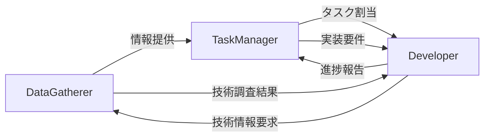

# エージェント役割分担ガイド

## 概要
プロジェクトを効率的に進めるため、3つの専門エージェントで役割を分担します。

## エージェント構成

### 1. DataGatherer（情報収集エージェント）
**役割**: プロジェクトに関する情報を収集・整理・共有

**主な機能**:
- Linear、GitHub、Slack、Perplexityから情報を自動収集
- プロジェクトの文脈情報を一元管理
- 外部の技術情報や市場調査
- ナレッジベースの構築と維持

**使用する主なツール**:
- MCP: Linear（読み取り専用）、GitHub、Slack、Perplexity
- Markdownify: ドキュメント変換
- WebSearch: 外部情報収集

**成果物**:
- knowledge_base/配下の情報ファイル
- 日次・週次レポート
- 技術調査結果

### 2. TaskManager（タスク管理エージェント）
**役割**: Linear上でプロジェクトとタスクを管理

**主な機能**:
- プロジェクトの計画と構造化
- タスクの作成・優先順位付け・進捗管理
- マイルストーン設定と追跡
- チーム間の調整とリソース管理

**使用する主なツール**:
- MCP: Linear（フル機能）
- 最小限のローカル設定ファイル

**Linear上での管理項目**:
- プロジェクト構造（Projects）
- タスクとサブタスク（Issues）
- ラベル体系（phase/type/priority）
- ドキュメントリンク管理

### 3. Developer（実装エージェント）※新規提案
**役割**: 実際のコード実装とシステム構築

**主な機能**:
- コードの実装・修正・リファクタリング
- テストの作成と実行
- デバッグとトラブルシューティング
- CI/CD設定とデプロイメント
- コードレビューとベストプラクティス適用

**使用する主なツール**:
- Bash: コマンド実行、ビルド、テスト
- Read/Write/Edit: コード編集
- Grep/Glob: コード検索
- GitHub MCP: PR作成、コミット管理

**成果物**:
- ソースコード
- テストコード
- 設定ファイル
- デプロイメントスクリプト

## 連携フロー



## 具体的な使い分け例

### 新機能開発の流れ

1. **DataGatherer**
   - 「この技術の最新トレンドを調査して」
   - 「競合製品の機能を分析して」
   - 「チームの過去の議論をまとめて」

2. **TaskManager**
   - 「新機能の開発プロジェクトを作成」
   - 「実装タスクをブレークダウンして」
   - 「マイルストーンを設定」
   - 「[Development] API実装」のようなタスクを作成

3. **Developer**
   - 「Linear ABC-123のタスクを実装して」
   - 「APIエンドポイントを作成」
   - 「単体テストを追加」
   - 「PRを作成してレビュー依頼」

### バグ修正の流れ

1. **DataGatherer**
   - エラーログの収集
   - 関連する過去の事例調査

2. **TaskManager**
   - 「[Bug] ユーザー認証エラー」のIssue作成
   - 優先度設定（priority:urgent）
   - 担当者アサイン

3. **Developer**
   - バグの原因調査
   - 修正コードの実装
   - テストケースの追加
   - 修正確認とPR作成

## コミュニケーション例

### プロジェクト開始時
```
User: 新しいチャット機能を開発したい

1. DataGatherer起動
   「チャット機能について市場調査して」
   「既存のチャットライブラリを調査」

2. TaskManager起動
   「チャット機能開発プロジェクトを作成」
   「必要なタスクを洗い出して」

3. Developer起動
   「プロジェクトのボイラープレートを作成」
   「開発環境をセットアップ」
```

### 日常的な開発
```
User: 今日の作業を始めたい

1. TaskManager起動
   「今日のタスクを確認」
   「優先度の高いものを表示」

2. Developer起動
   「Linear DEV-456を実装して」
   「テストを実行して結果を確認」

3. TaskManager起動
   「DEV-456を完了にして」
   「次のタスクを確認」
```

## エージェント選択ガイドライン

| やりたいこと | 使用エージェント |
|------------|--------------|
| 市場調査・技術調査 | DataGatherer |
| 過去の情報を探す | DataGatherer |
| タスクの作成・管理 | TaskManager |
| 進捗確認・レポート | TaskManager |
| コード実装 | Developer |
| テスト作成・実行 | Developer |
| デバッグ | Developer |
| デプロイ | Developer |

## ベストプラクティス

1. **明確な境界**
   - 各エージェントの役割を混在させない
   - 1つのタスクは1つのエージェントで完結

2. **Linear中心の情報共有**
   - すべての作業はLinear上のタスクとして管理
   - 進捗や成果物のリンクはLinearに集約

3. **順序立てた作業**
   - 調査 → 計画 → 実装の順序を守る
   - 各フェーズで適切なエージェントを使用

4. **フィードバックループ**
   - 実装中の課題はTaskManagerにフィードバック
   - 技術的な調査が必要ならDataGathererに依頼