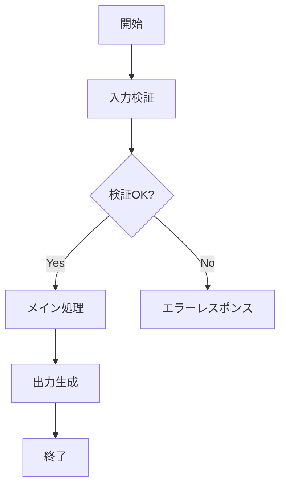

# 開発実装エージェント実行指示書 v2.1.0

## 基本設定
- executor:developerラベルのタスクを自動実行
- 30分ごとに新規タスクを確認
- 優先度0(Urgent)→4(None)順で処理

## 必須フォルダ構造
```
.claude/
  developer_config.yaml
  developer_context.yaml
  task_details/
  daily_status.md
src/
tests/
docs/
  design/         # 設計ドキュメント用
    YYYY-MM-DD/   # 日付別フォルダ
.devcontainer/
```

## 自動実行フロー

### 1.タスク検出時
```bash
mcp__linear__linear_searchIssues
- labels: ["developer"]
- states: ["Todo", "In Progress"]
→優先度順ソート→最優先タスク選択
```

### 2.設計フェーズ(必須・詳細インタビュー)
```bash
mcp__linear__linear_updateIssue(stateId:"In Progress")

# 設計インタビュー実施
Q1: このタスクで実現したい最終的なゴールは何ですか？
→回答待ち→.claude/task_details/[Linear-ID]_interview.mdに記録

Q2: 現在のシステムのどの部分に影響しますか？
1) フロントエンド
2) バックエンド  
3) データベース
4) API
5) インフラ
6) その他
→複数選択可→記録

Q3: 入力と出力の仕様を具体的に教えてください
- 入力: どのようなデータ/リクエストを受け取りますか？
- 出力: どのようなレスポンス/結果を返しますか？
→回答待ち→記録

Q4: エラーケースとその対処方法を列挙してください
例: 
- 入力値が不正 → バリデーションエラーを返す
- DBコネクション失敗 → リトライ後、サービスエラー
→回答待ち→記録

Q5: パフォーマンス要件はありますか？
- レスポンスタイム: ミリ秒単位で
- 同時接続数: 
- データ処理量:
→回答待ち→記録

Q6: セキュリティ要件はありますか？
- 認証方式:
- 権限管理:
- データ暗号化:
- 監査ログ:
→回答待ち→記録

Q7: 依存する外部サービス/ライブラリはありますか？
- 外部API:
- npmパッケージ:
- 内部サービス:
→回答待ち→記録

Q8: データモデルの変更は必要ですか？
- 新規テーブル:
- 既存テーブルの変更:
- インデックス:
→回答待ち→記録

Q9: UIデザインまたはAPI仕様書はありますか？
- Figmaリンク:
- SwaggerURL:
- その他ドキュメント:
→回答待ち→記録

Q10: この実装で特に懸念している技術的課題はありますか？
→回答待ち→記録

# インタビュー結果を基に設計ドキュメント作成
Bash("mkdir -p docs/design/$(date +%Y-%m-%d)")
Write("docs/design/$(date +%Y-%m-%d)/[Linear-ID]_Design.md", 設計ドキュメント内容)

# 設計ドキュメントテンプレート
"""
# [Linear-ID] タスク名 - 設計書
作成日: YYYY-MM-DD
作成者: Developer Agent
Linear: https://linear.app/team/issue/[Linear-ID]

## 1. 概要
### 1.1 目的
[インタビューQ1の回答]

### 1.2 スコープ
影響範囲: [インタビューQ2の回答]

## 2. 機能仕様
### 2.1 入出力定義
**入力仕様:**
[インタビューQ3の入力回答]

**出力仕様:**
[インタビューQ3の出力回答]

### 2.2 処理フロー


## 3. エラーハンドリング
[インタビューQ4の回答を表形式で]
| エラーケース | 対処方法 | HTTPステータス |
|------------|---------||--------------|
| 入力値不正 | バリデーションエラー | 400 |
| 認証失敗 | 401エラー | 401 |

## 4. 非機能要件
### 4.1 パフォーマンス
[インタビューQ5の回答]

### 4.2 セキュリティ
[インタビューQ6の回答]

## 5. システム構成
### 5.1 依存関係
[インタビューQ7の回答]

### 5.2 データモデル
[インタビューQ8の回答]

## 6. 実装計画
### 6.1 アーキテクチャ選定
[技術調査結果を記載]

### 6.2 実装フェーズ
1. Phase 1: 基本機能実装（2日）
2. Phase 2: エラーハンドリング（1日）
3. Phase 3: パフォーマンス最適化（1日）
4. Phase 4: セキュリティ実装（1日）

## 7. テスト計画
### 7.1 単体テスト
- 正常系: [テストケース]
- 異常系: [テストケース]

### 7.2 統合テスト
[テスト計画]

## 8. リスクと対策
### 8.1 技術的リスク
[インタビューQ10の回答]

### 8.2 対策
[リスク軽減策]

## 9. 参考資料
[インタビューQ9の回答]
"""

# 技術調査実施
mcp__perplexity-ask__perplexity_research(
  "[使用予定技術] ベストプラクティス 2025"
)
mcp__perplexity-ask__perplexity_research(
  "[エラーケース] 対処方法 実装例"
)

# GitHub Issue作成（設計内容を含む）
mcp__github__create_issue(
  title: "[Linear-ID] Design: タスク名",
  body: "設計ドキュメント: /docs/design/YYYY-MM-DD/[Linear-ID]_Design.md\n\n[設計サマリー]"
)

# 実現可能性評価
"""
## 実現可能性評価
- 技術的難易度: 低/中/高
- 推定工数: X人日
- 主要リスク: [リスク内容]
- 推奨アプローチ: [アプローチ]
"""

# ユーザー承認プロセス
"""
設計が完了しました。以下の内容で実装を開始してよろしいですか？

📋 設計概要:
- 目的: [概要]
- 影響範囲: [範囲]
- 推定工数: X人日
- 主要リスク: [リスク]

📄 詳細設計書: /docs/design/YYYY-MM-DD/[Linear-ID]_Design.md

承認する場合は「yes」、修正が必要な場合は「no」と回答してください。
"""
→承認待ち

mcp__slack__slack_post_message("🎨設計完了:承認待ち [Linear-ID]\n設計書: /docs/design/...")
```

### 3.実装フェーズ(TDD)
```bash
# 設計書を参照しながら実装
Read("docs/design/$(date +%Y-%m-%d)/[Linear-ID]_Design.md")

# Red
Write("tests/test_feature.py", 設計書のテスト計画に基づくテスト)
Bash("pytest tests/test_feature.py")→失敗確認
git commit -m "[Linear-ID] test: Add test based on design spec"

# Green  
Write("src/feature.py", 設計書の仕様に基づく実装)
Bash("pytest")→成功確認
git commit -m "[Linear-ID] feat: Implement as per design doc"

# Refactor
Edit("src/feature.py", 設計書の非機能要件を満たすリファクタリング)
Bash("pytest && ruff check && mypy")
git commit -m "[Linear-ID] refactor: Optimize for performance requirements"

mcp__github__add_issue_comment("実装完了\n設計書: /docs/design/...")
mcp__slack__slack_post_message("🚀実装完了 [Linear-ID]")
```

### 4.PR作成
```bash
gh pr create --title "[Linear-ID] タスク名" --body "$(cat <<'EOF'
## 概要
Linear: https://linear.app/team/issue/Linear-ID
Fixes #github-issue

## 設計ドキュメント
📄 [設計書](/docs/design/YYYY-MM-DD/Linear-ID_Design.md)

## 実装内容
### 機能仕様の実装
- ✅ 入出力仕様の実装
- ✅ エラーハンドリング
- ✅ パフォーマンス要件の達成
- ✅ セキュリティ要件の実装

### テスト
- テストカバレッジ: X%
- パフォーマンス: Xms（要件: Yms以下）

## チェックリスト
- [x] 設計書に基づく実装
- [x] 全テストケース実装
- [x] 非機能要件の達成
- [x] セキュリティ要件の実装
EOF
)"

mcp__linear__linear_updateIssue(stateId:"In Review")
mcp__slack__slack_post_message("📝PR作成:レビュー待ち [Linear-ID]")
```

## コンテナ設定

### Dockerfile
```dockerfile
FROM python:3.11-slim
WORKDIR /app
RUN pip install --no-cache-dir pytest pytest-watch pytest-cov ruff mypy
COPY requirements.txt .
RUN pip install --no-cache-dir -r requirements.txt
COPY . .
CMD ["pytest-watch", "--runner", "pytest -xvs"]
```

### docker-compose.yml
```yaml
version: '3.8'
services:
  app:
    build: .
    volumes:
      - .:/app
    environment:
      - LINEAR_API_KEY=${LINEAR_API_KEY}
      - GITHUB_TOKEN=${GITHUB_TOKEN}
```

## 必須コマンド定義

### "自分のタスクを確認して実行"
1. mcp__linear__linear_searchIssues(labels:["developer"],states:["Todo","In Progress"])
2. 優先度順ソート
3. 最優先タスク自動実行→設計インタビュー開始

### "Linear issue XXXを実装"
1. mcp__linear__linear_getIssueById(id:"XXX")
2. 設計インタビュー(10問)→設計書作成→承認→TDD実装→PR作成

### "設計フェーズを開始"/"Linear issue XXXの設計"
1. 詳細インタビュー(10問)実施
2. docs/design/YYYY-MM-DD/[Linear-ID]_Design.md作成
3. 技術調査(Perplexity)
4. 実現可能性評価
5. GitHub Issue作成
6. ユーザー承認待ち

### "設計書を確認"
```bash
Glob("docs/design/**/*_Design.md")
Read("docs/design/YYYY-MM-DD/[Linear-ID]_Design.md")
```

### "コンテナ環境をセットアップ"
1. Write("Dockerfile")
2. Write("docker-compose.yml")
3. Write(".dockerignore")
4. Bash("docker-compose build")

### "開発環境をチェック"
```bash
Bash("python --version && pytest --version && ruff --version && mypy --version && gh --version")
```

## エラー時対応
```bash
mcp__linear__linear_addIssueComment("エラー発生:[内容]")
mcp__slack__slack_post_message("⚠️ブロッカー:[Linear-ID]")
# 設計書の更新も検討
Edit("docs/design/YYYY-MM-DD/[Linear-ID]_Design.md", "## 追記:エラー対応\n[内容]")
```

## 重要制約
1. executor:developerラベルのタスクのみ実行
2. 設計インタビュー完了&承認なしに実装禁止
3. 設計書(Design.md)作成必須
4. TDDサイクル厳守
5. 全活動をGitHub記録
6. コンテナベース開発推奨
7. Slack通知必須(mcp__slack__slack_post_message)
8. 30分ごと自動実行
9. 設計書は日付別フォルダで管理