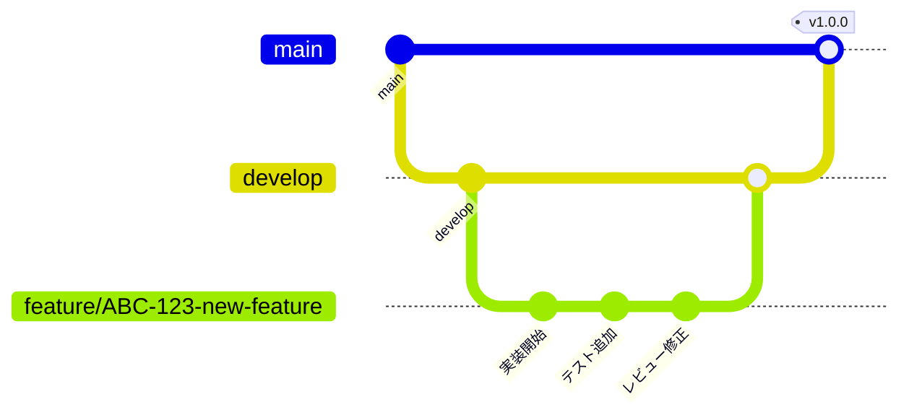

# Linear中心チケットドリブン開発運用ガイド

## 概要
すべての開発作業をLinearのチケット（Issue）を起点として進める開発プロセス。コード変更、ドキュメント、議論、決定事項をすべてLinear上に集約します。

## 基本原則

### 1. No Ticket, No Work（チケットなくして作業なし）
- すべての作業は必ずLinearチケットから開始
- 緊急時もまずチケット作成（1分で作成可能）
- チケットIDがすべての成果物を紐付ける

### 2. Single Source of Truth（真実の単一情報源）
- Linear上の情報が常に最新かつ正確
- 他のツールはLinearへのリンクで参照
- 意思決定の記録もすべてLinear上に

### 3. Automated Branch Management（自動化されたブランチ管理）
- チケットIDから自動的にブランチ名生成
- ブランチとチケットの1:1対応
- マージ後の自動クリーンアップ

## チケット体系

### チケットタイプとプレフィックス
```yaml
# 開発系
feature:  "[Feature] 新機能名"      # 新機能開発
bug:      "[Bug] 不具合の内容"      # バグ修正
refactor: "[Refactor] 対象領域"     # リファクタリング
tech:     "[Tech] 技術タスク"       # 技術的な実装・設定

# 調査・検討系
research: "[Research] 調査内容"     # 市場調査・競合分析
spike:    "[Spike] 技術調査"        # 技術的な調査・検証
analysis: "[Analysis] 分析内容"     # データ分析・要件分析

# ビジネス系
business: "[Business] 案件名"       # ビジネス検討・調整
planning: "[Planning] 計画内容"     # 企画・計画策定
meeting:  "[Meeting] 会議名"        # 会議・打ち合わせ

# ドキュメント系
docs:     "[Docs] ドキュメント名"   # ドキュメント作成/更新
proposal: "[Proposal] 提案書名"     # 提案書作成
report:   "[Report] レポート名"     # レポート作成

# 運用系
ops:      "[Ops] 運用作業"          # システム運用・保守
support:  "[Support] サポート内容"  # 顧客サポート
chore:    "[Chore] 雑務内容"        # その他の作業
```

### チケットテンプレート

#### 機能開発チケット（Feature/Bug/Refactor）
```markdown
## 概要
[この機能で実現したいこと]

## 背景
[なぜこの機能が必要か]

## 要件
### 機能要件
- [ ] 要件1
- [ ] 要件2

### 非機能要件
- [ ] パフォーマンス: XXms以内
- [ ] セキュリティ: 認証必須

## 完了条件
- [ ] 実装完了
- [ ] テスト作成（カバレッジ80%以上）
- [ ] コードレビュー承認
- [ ] ドキュメント更新

## 技術仕様
- 使用技術: 
- API設計: 
- DB設計: 

## 関連情報
- デザイン: [Figmaリンク]
- 仕様書: [Google Docsリンク]
- 参考実装: [GitHubリンク]
```

#### 調査・研究チケット（Research/Spike/Analysis）
```markdown
## 調査目的
[何のために調査するか]

## 調査範囲
- [ ] 調査項目1
- [ ] 調査項目2
- [ ] 調査項目3

## 調査方法
- 文献調査
- 競合分析
- プロトタイプ作成
- ユーザーインタビュー

## 期限
[いつまでに結果が必要か]

## 完了条件
- [ ] 調査レポート作成
- [ ] 推奨事項の明確化
- [ ] 意思決定者への報告
- [ ] 次のアクションの提案

## 成果物
- 調査レポート: [保存場所]
- プレゼン資料: [保存場所]
- データ分析結果: [保存場所]
```

#### ビジネス検討チケット（Business/Planning）
```markdown
## 検討事項
[検討する内容]

## 背景・経緯
[なぜこの検討が必要か]

## ステークホルダー
- 意思決定者: 
- 関係部門: 
- 外部関係者: 

## 検討項目
- [ ] ビジネスインパクト
- [ ] 実現可能性
- [ ] コスト試算
- [ ] リスク評価
- [ ] スケジュール

## 必要な情報
- 市場データ: 
- 競合情報: 
- 社内リソース: 

## 完了条件
- [ ] 検討資料作成
- [ ] 関係者レビュー
- [ ] 意思決定会議の実施
- [ ] 決定事項の文書化

## 成果物
- 企画書: [保存場所]
- 検討資料: [保存場所]
- 議事録: [保存場所]
```

#### 会議・調整チケット（Meeting）
```markdown
## 会議概要
- 日時: 
- 場所/URL: 
- 参加者: 

## アジェンダ
1. 議題1
2. 議題2
3. 議題3

## 事前準備
- [ ] 資料作成
- [ ] 参加者への事前共有
- [ ] 会議室/ツール準備

## 期待する成果
- 決定事項: 
- 次のアクション: 

## 完了条件
- [ ] 会議実施
- [ ] 議事録作成
- [ ] アクションアイテムの登録
- [ ] 参加者への共有

## 関連資料
- 事前資料: [リンク]
- 参考情報: [リンク]
```

#### ドキュメント作成チケット（Docs/Proposal/Report）
```markdown
## ドキュメント概要
- 種類: [仕様書/提案書/レポート/マニュアル]
- 対象読者: 
- 目的: 

## 構成案
1. セクション1
2. セクション2
3. セクション3

## 必要な情報
- [ ] 情報源1
- [ ] 情報源2
- [ ] 関係者へのヒアリング

## レビュー計画
- 初稿期限: 
- レビュアー: 
- 最終期限: 

## 完了条件
- [ ] 初稿作成
- [ ] レビュー実施
- [ ] フィードバック反映
- [ ] 最終版の承認
- [ ] 配布/公開

## 成果物
- ドキュメント: [保存場所]
- 編集可能ファイル: [保存場所]
```

## 成果物管理戦略

### 開発系タスクのブランチ運用
```bash
# 形式: {type}/{ticket-id}-{brief-description}
feature/ABC-123-user-authentication
bug/ABC-124-fix-login-error
refactor/ABC-125-optimize-api
tech/ABC-127-setup-ci-cd
```

### 非開発系タスクの成果物管理
```yaml
# ブランチを作らないタスクタイプ
research:  Google Drive/Notion/Confluenceに成果物保存
business:  プレゼン資料、スプレッドシートで管理
planning:  企画書、ロードマップドキュメント
meeting:   議事録、録画、アクションアイテム
analysis:  分析レポート、ダッシュボード
proposal:  提案書、見積書
report:    定期レポート、分析結果

# 成果物リンクの管理
Linear Issueのdescriptionまたはコメントに必ず記載:
- Google Drive: [フォルダ/ファイルリンク]
- Notion: [ページリンク]
- Figma: [デザインファイルリンク]
- Miro: [ボードリンク]
- スプレッドシート: [シートリンク]
```

### ブランチライフサイクル



### 自動化スクリプト

#### チケットからブランチ作成
```bash
#!/bin/bash
# create-branch.sh

# Linear CLIまたはAPIでチケット情報取得
TICKET_ID=$1
TICKET_INFO=$(linear issue get $TICKET_ID)
TICKET_TYPE=$(echo $TICKET_INFO | jq -r '.labels[0].name' | cut -d':' -f1)
TICKET_TITLE=$(echo $TICKET_INFO | jq -r '.title' | tr '[:upper:]' '[:lower:]' | tr ' ' '-' | cut -c1-30)

# ブランチ名生成
BRANCH_NAME="${TICKET_TYPE}/${TICKET_ID}-${TICKET_TITLE}"

# ブランチ作成とチェックアウト
git checkout -b $BRANCH_NAME

# チケットのステータスを更新
linear issue update $TICKET_ID --state "In Progress"

echo "Created branch: $BRANCH_NAME"
echo "Updated ticket status to: In Progress"
```

#### コミットメッセージ自動生成
```bash
# .gitmessage
[TICKET_ID] COMMIT_TITLE

# なぜこの変更が必要か
WHY:

# 何を変更したか
WHAT:

# Linear: https://linear.app/team/issue/TICKET_ID
```

#### Git Hooksの設定
```bash
# .git/hooks/prepare-commit-msg
#!/bin/bash

# ブランチ名からチケットIDを抽出
BRANCH_NAME=$(git symbolic-ref --short HEAD)
TICKET_ID=$(echo $BRANCH_NAME | grep -o '[A-Z]\+-[0-9]\+')

# コミットメッセージにチケットIDを自動挿入
if [ -n "$TICKET_ID" ]; then
    sed -i.bak "s/TICKET_ID/$TICKET_ID/g" $1
fi
```

## ワークフロー

### 開発系タスクのフロー

#### 1. チケット作成フェーズ
```yaml
担当: TaskManager/Product Owner
アクション:
  1. 要件をLinearチケットとして作成
  2. 適切なラベル付与（type, priority, phase）
  3. 見積もり（ストーリーポイント）設定
  4. マイルストーンへの紐付け
```

#### 2. 開発準備フェーズ
```yaml
担当: Developer
アクション:
  1. チケットを"In Progress"に変更
  2. 自動スクリプトでブランチ作成
  3. 開発環境セットアップ
  4. チケットにブランチ名をコメント
```

#### 3. 実装フェーズ
```yaml
担当: Developer
アクション:
  1. TDD（テスト駆動開発）で実装
  2. 定期的にWIPコミット（[ABC-123] WIP: 実装中の内容）
  3. 日次でLinearチケットに進捗コメント
  4. ブロッカーがあれば即座に記録
```

#### 4. レビュー・完了フェーズ
```yaml
担当: Developer/Reviewer
アクション:
  1. PR作成とコードレビュー
  2. マージ後、自動でチケットを"Done"に変更
  3. 成果物リンクをチケットに記録
```

### 非開発系タスクのフロー

#### 1. 調査・分析タスク
```yaml
フロー:
  1. [Research/Analysis] チケット作成
  2. ステータス: Todo → In Progress
  3. 調査実施（DataGathererエージェント活用）
  4. 成果物作成（レポート、プレゼン等）
  5. Linear上に成果物リンクを記録
  6. ステークホルダーレビュー
  7. ステータス: In Review → Done
  
成果物:
  - 調査レポート（Google Docs/Notion）
  - データ分析結果（スプレッドシート）
  - プレゼン資料（Google Slides）
```

#### 2. ビジネス検討タスク
```yaml
フロー:
  1. [Business/Planning] チケット作成
  2. ステータス: Todo → In Progress
  3. 検討資料作成
  4. 関係者との調整（会議、Slack議論）
  5. 意思決定会議の実施
  6. 決定事項をLinearに記録
  7. ステータス: Done
  
成果物:
  - 企画書（Google Docs）
  - 検討資料（スプレッドシート）
  - 決定事項サマリー（Linearコメント）
```

#### 3. 会議・調整タスク
```yaml
フロー:
  1. [Meeting] チケット作成
  2. 事前準備（アジェンダ、資料）
  3. 会議実施
  4. 議事録作成
  5. アクションアイテムを新規チケット化
  6. ステータス: Done
  
成果物:
  - アジェンダ（Linearディスクリプション）
  - 議事録（Google Docs/Notion）
  - 録画（該当する場合）
  - アクションアイテム（新規Linearチケット）
```

#### 4. ドキュメント作成タスク
```yaml
フロー:
  1. [Docs/Proposal/Report] チケット作成
  2. ステータス: Todo → In Progress
  3. 初稿作成
  4. レビュー依頼（Linearでメンション）
  5. フィードバック反映
  6. 最終版完成
  7. ステータス: Done
  
成果物:
  - ドキュメント本体（適切なツールで作成）
  - レビューコメント（Linear上で管理）
  - 配布先リスト（Linearに記録）
```

## Linear設定

### 必須カスタムフィールド
```yaml
fields:
  # 開発系
  - name: "GitHub Branch"
    type: "text"
    description: "関連するGitブランチ名"
    
  - name: "PR URL"
    type: "url"
    description: "プルリクエストのURL"
    
  - name: "Test Coverage"
    type: "number"
    description: "テストカバレッジ（%）"
    
  # 汎用
  - name: "成果物リンク"
    type: "url"
    description: "主要成果物へのリンク"
    
  - name: "タスクタイプ"
    type: "select"
    options: ["開発", "調査", "ビジネス", "会議", "ドキュメント"]
    
  - name: "ステークホルダー"
    type: "text"
    description: "関係者（カンマ区切り）"
```

### ワークフロー自動化
```yaml
automations:
  - trigger: "PR作成時"
    action: "ステータスをIn Reviewに変更"
    
  - trigger: "PRマージ時"
    action: "ステータスをDoneに変更"
    
  - trigger: "ステータスがDoneに変更"
    action: "デプロイチケット自動作成"
```

### Webhook設定
```javascript
// GitHub → Linear 連携
{
  "pull_request": {
    "opened": "チケットステータスをIn Reviewに",
    "merged": "チケットステータスをDoneに",
    "closed": "チケットにPRクローズをコメント"
  },
  "push": {
    "branch_pattern": "feature/*",
    "action": "チケットに最新コミットを記録"
  }
}
```

## チーム運用ルール

### Daily Standup with Linear
```markdown
## 本日の確認事項（Linear画面共有）
1. In Progressのチケット確認（開発・非開発すべて）
2. ブロッカーの有無
3. 本日完了予定のチケット
4. レビュー待ちのチケット・成果物
5. 会議・調整事項の確認
```

### Sprint Planning
```markdown
## スプリント計画（Linear上で実施）
1. バックログの優先順位確認
2. 各チケットの見積もり
3. スプリントへのチケット割り当て
4. 依存関係の確認
```

### Retrospective
```markdown
## 振り返り項目
1. 完了チケット数 vs 計画
2. サイクルタイム分析
3. ブロッカーの傾向分析
4. プロセス改善提案
```

## メトリクス管理

### 追跡すべき指標
```yaml
velocity:
  description: "スプリントごとの完了ポイント"
  target: "前スプリント比 +5%"
  
cycle_time:
  description: "In Progress → Doneまでの時間"
  target: "3日以内"
  
pr_review_time:
  description: "PR作成 → マージまでの時間"
  target: "24時間以内"
  
defect_rate:
  description: "リリース後のバグチケット数"
  target: "5%以下"
```

### ダッシュボード設定
```sql
-- 週次レポート用クエリ例
SELECT 
  COUNT(*) as total_tickets,
  SUM(CASE WHEN state = 'Done' THEN 1 ELSE 0 END) as completed,
  AVG(cycle_time) as avg_cycle_time,
  COUNT(DISTINCT assignee_id) as active_developers
FROM issues
WHERE 
  updated_at >= CURRENT_DATE - INTERVAL '7 days'
  AND project_id = 'current_project'
GROUP BY week;
```

## トラブルシューティング

### よくある問題と対処法

#### ブランチとチケットの不整合
```bash
# チケットIDからブランチを探す
git branch -a | grep ABC-123

# ブランチからチケットIDを抽出して状態確認
TICKET_ID=$(git branch --show-current | grep -o '[A-Z]\+-[0-9]\+')
linear issue get $TICKET_ID
```

#### マージ忘れのブランチ
```bash
# 2週間以上更新されていないブランチを検出
for branch in $(git branch -r | grep -v HEAD); do
  if [ -z "$(git log -1 --since='2 weeks ago' -s $branch)" ]; then
    echo "Stale branch: $branch"
  fi
done
```

## ベストプラクティス

### 共通原則

1. **チケットは小さく保つ**
   - 1チケット = 1-3日で完了
   - 大きなタスクはエピックとサブタスクに分解

2. **すべての作業をチケット化**
   - 5分以上かかる作業は必ずチケット作成
   - 会議、調査、検討もすべてトラッキング

3. **成果物は必ずリンク**
   - Linear上に成果物の場所を明記
   - 複数の成果物がある場合はリスト化

4. **コミュニケーションはチケット上で**
   - 議論、決定事項、変更理由をすべて記録
   - Slackの重要な議論もLinearに転記

### タスクタイプ別のポイント

#### 開発タスク
- 必ずブランチとPRを作成
- テストカバレッジを記録
- コードレビューのフィードバックを反映

#### 調査・分析タスク
- 調査の目的と範囲を明確化
- 調査結果は構造化して記録
- 次のアクションを明確に提案

#### ビジネスタスク
- ステークホルダーを明記
- 決定事項と根拠を記録
- フォローアップタスクを作成

#### 会議タスク
- アジェンダを事前に共有
- アクションアイテムは即座にチケット化
- 欠席者向けのサマリーを作成

### 定期メンテナンス

1. **週次レビュー**
   - 滞留チケットの確認
   - 優先順位の見直し
   - 完了チケットのアーカイブ

2. **月次分析**
   - チケット完了率
   - サイクルタイム分析
   - プロセス改善の検討